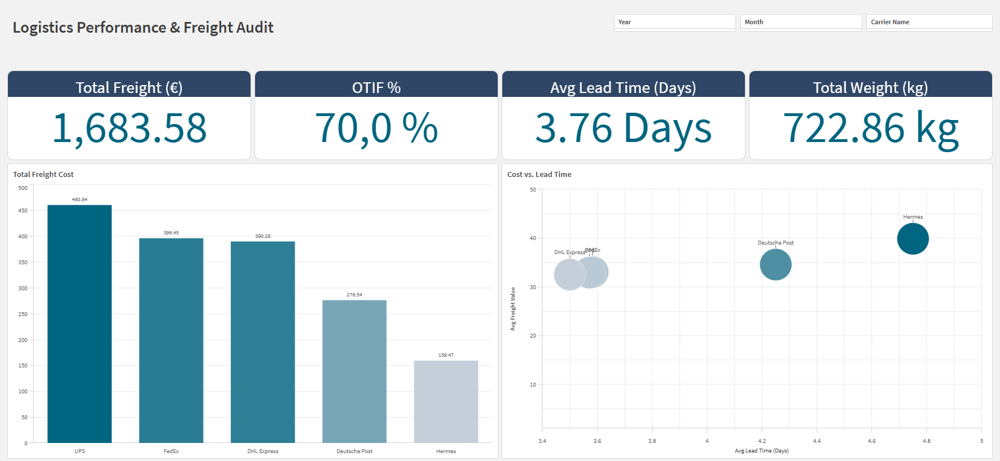

# Logistics Performance & Freight Audit Dashboard

## 📊 Dashboard Preview

### Data Model

## 📌 Overview
This project features a comprehensive **Freight Audit & Carrier Benchmarking Dashboard** developed in Qlik Sense. It was designed to provide logistics managers with actionable insights into transportation costs, delivery efficiency (OTIF), and carrier performance.

## 📊 Key Insights & Business Value
* **Cost vs. Performance Benchmarking:** A Scatter Plot analysis that identifies which carriers provide the best value (low cost vs. low lead time).
* **Service Level Monitoring:** Real-time tracking of **OTIF (On-Time In-Full %)** to ensure customer satisfaction.
* **Operational Efficiency:** Monitoring average **Lead Time** to identify bottlenecks in the supply chain.

## 🛠 Technical Features
* **Data Modeling:** Implementation of a **Star Schema** with a custom **Master Calendar** to enable time-intelligence (Year, Month, Quarter).
* **ETL & Data Cleaning:** Advanced Qlik Scripting to handle international data formats (Decimal/Thousand separators) and data type conversions.
* **Set Analysis:** Dynamic KPI calculations that respond to user filters across the entire data model.

## 📁 Repository Structure
* `app/`: Contains the `.qvf` Qlik Sense application.
* `script/`: Full Load Script for technical review.
* `data/`: Sample logistics dataset (CSV).
* `img/`: Dashboard screenshots and Data Model visualization.

## 🚀 How to use
1. Download the `.qvf` file from the `app/` folder.
2. Open it in Qlik Sense Desktop or Qlik Cloud.
3. If necessary, update the data connection path to point to the `data/` folder CSV.

---
**Developed by Abimael Brilhante Soares**
*Focus: Data Analytics | Logistics | SAP Finance Integration*
